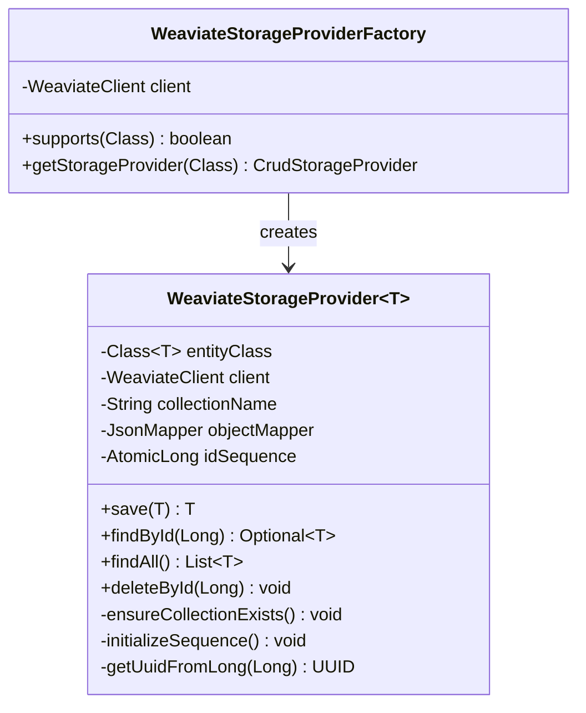

# Weaviate Storage Module Architecture (Mermaid)

This file contains Mermaid diagrams visualizing the structure and design of the Weaviate storage module (`crud-engine-weaviate`).

## 1. Class Structure



## 2. Deterministic UUID Generator Flow

```mermaid
graph TD
    start([Start generate UUID]) --> checkNull{Is numeric ID null?}
    checkNull -- Yes --> returnNull[Return null]
    checkNull -- No --> toString[Convert long to String]
    toString --> getBytes[Get UTF-8 bytes]
    getBytes --> nameUUID[UUID.nameUUIDFromBytes]
    nameUUID --> returnUUID([Return deterministic UUID])
```
